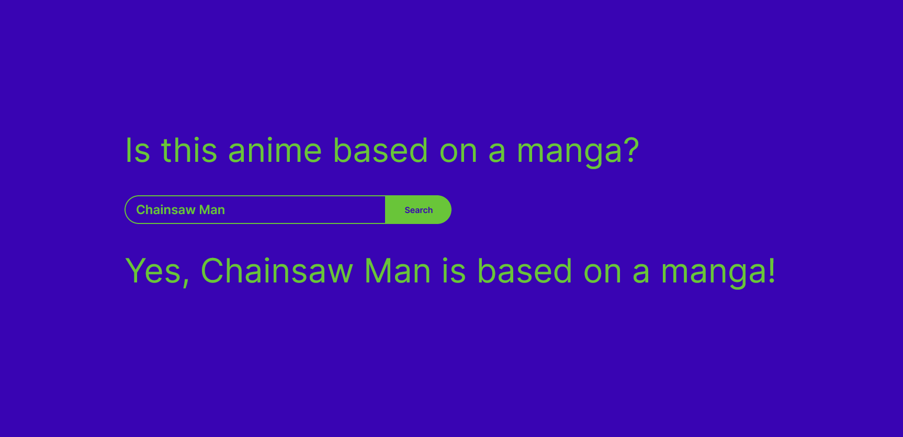

# Anime Source

Find out whether an anime is based on a manga.

[Live site]([https://duckduckgo.com](https://kyem-asa.github.io/anime-source/))

## How It's Made:

**Tech used:** HTML, CSS, JavaScript

This project uses the Jikan anime API.

## Future updates:
- Check reverse, if a manga has an anime
- Check light novel as a source
